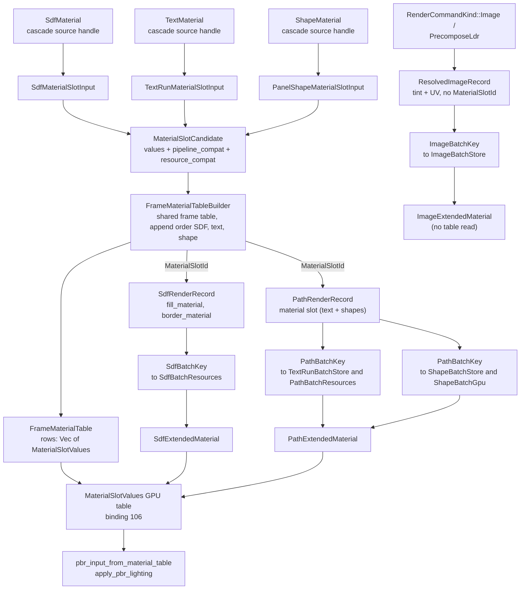
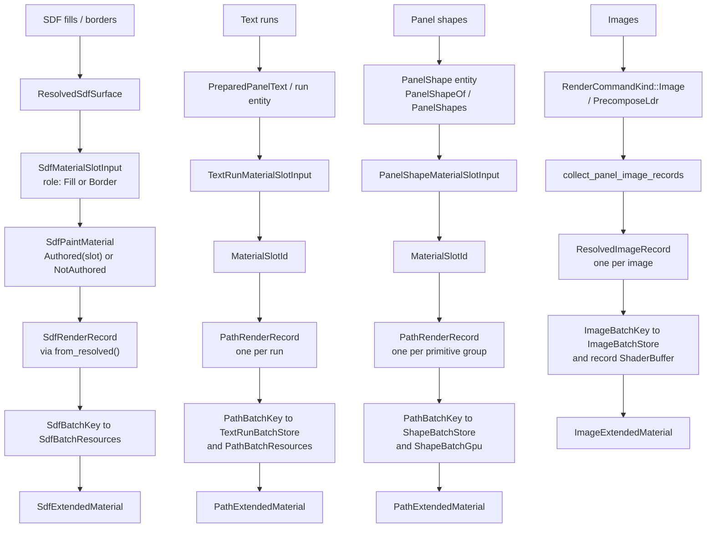
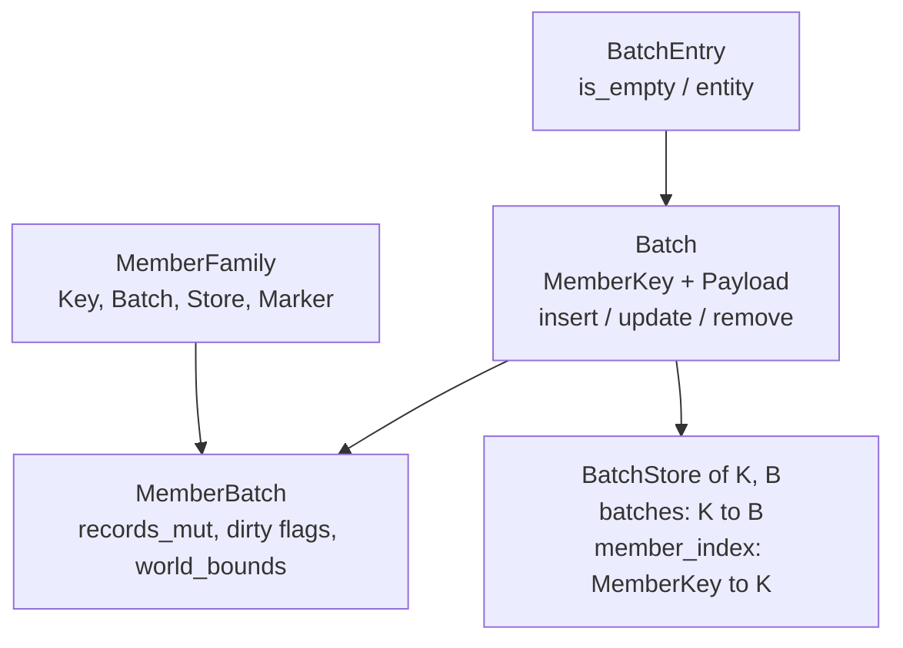
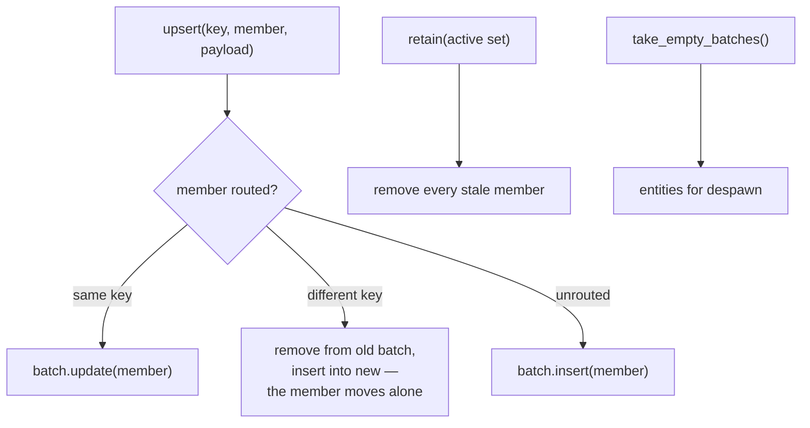
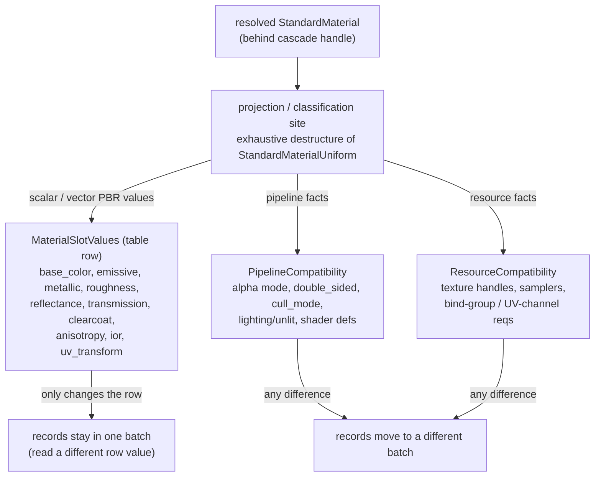
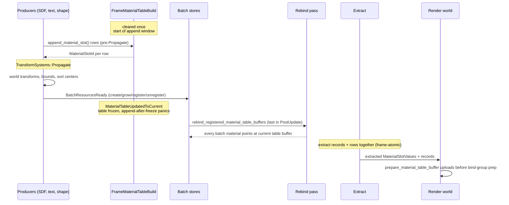
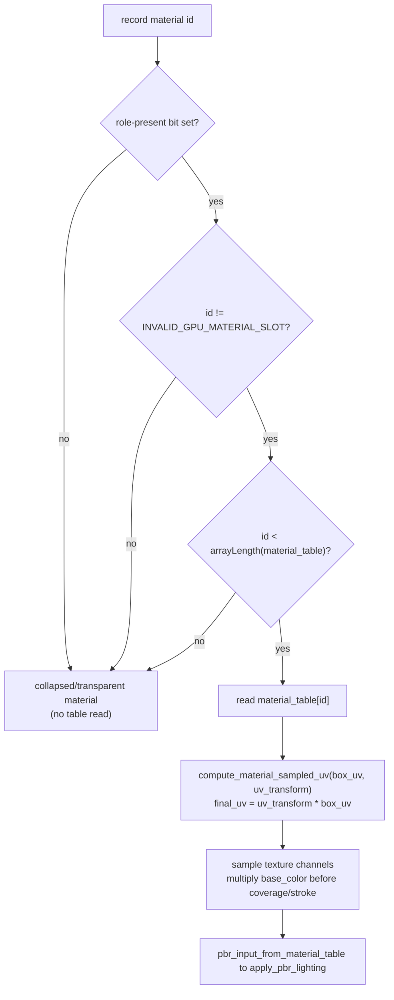

# Batching Call Flow — Diagrams

> Companion to [`material-table-batching.md`](./material-table-batching.md) and [`image-batching.md`](./image-batching.md).
> Mermaid views of the batching call flow as built: four render families
> (SDF fills/borders, text runs, panel shapes, images) routing retained members
> through one generic `BatchStore`, with three of those families converging on a
> shared frame material table read by two render materials. Images batch the
> same way but sit outside the material table (section 6).

The critical idea: a batch key carries no scalar/vector PBR values.
Those live in a per-frame dense table (`FrameMaterialTable`) addressed by a
frame-local `MaterialSlotId`. Two records that differ only by table values share
a batch; they split only on pipeline/resource compatibility.

## 1. The whole flow at a glance

Four families, four batch stores, three render materials. SDF, text, and shapes
share one append path into one frame table and one GPU table buffer; images
batch through the same store mechanics but never touch the table.



Depth is owned by draw order, not the table: `DrawZIndexRank` →
`ScreenDepthBias` (per-band bias on the batch material), `DrawOrderIndex` →
`ClipDepthNudge` / `OitDepthOffset` (per-record). Authored
`StandardMaterial::depth_bias` never enters the flow.

## 2. Per-family vertical slices

Same backbone, different source identity and record type for each family. SDF
keeps its own key/material; text and panel shapes share the analytic path types;
images skip the material-slot steps entirely (no cascade handle, no
`MaterialSlotId`) — tint and texture stay on the record and material directly.



Notes on the split lines:

- **SDF** has two material roles per surface (`Fill`, `Border`), so its record
  carries two slot fields. `SdfPaintMaterial::NotAuthored` becomes
  `INVALID_GPU_MATERIAL_SLOT` (`u32::MAX`); the shader skips the table read for
  that role.
- **Text runs and `PanelShape` primitives share** `PathExtendedMaterial` /
  `PathExtension`, `PathBatchKey`, and the analytic path shader. Text routes
  runs through `TextRunBatchStore` with `PathBatchResources`; `PanelShape`
  primitives route groups through `ShapeBatchStore` with `ShapeBatchGpu`.
- **Slot id is frame-local.** Every live record re-appends or refreshes its row
  and rewrites its slot id each frame, even with unchanged geometry.
- **Images have no cascade material handle and no slot.** Their batches split on
  `ImageBatchKey` (texture, render layers, shadow policy, `DrawZIndex`,
  `DrawZIndexRank`); everything else stays on the record (section 6).

## 3. Member routing — the shared `BatchStore`

All four families route retained members through one generic store
(`render/batch_store.rs`). A **member** is one element's draw contribution; a
**batch** groups members by a GPU-compatibility key; the store keeps the
member-to-batch index so a member whose key changes moves alone — the rest of
its batch stays put.

The trait stack:



The routing lifecycle:



Per-family wiring:

| Family | Store | K (batch key) | B (batch) | MemberKey | Membership unit |
|---|---|---|---|---|---|
| SDF fills/borders | `SdfBatchStore` (newtype) | `SdfBatchKey` | `SdfBatch` | `SdfRecordKey` | one record per element (two when a clipped border splits fill/border) |
| Images | `ImageBatchStore` (newtype) | `ImageBatchKey` | `ImageBatch` | `ImageRecordKey` | one record per image |
| Text runs | `TextRunBatchStore` (newtype) | `PathBatchKey` | `TextRunBatch` | `RunStorageKey` | one run (owns its glyph quads) |
| Panel shapes | `ShapeBatchStore` (wrapper) | `PathBatchKey` | `ShapeBatch` | `PanelShapeRenderKey` | one primitive group |

- `ShapeBatchStore` is the one non-newtype wrapper: alongside the `BatchStore`
  it keeps `panel_members` (panel-scoped retain bookkeeping, because
  `ResolvedPanelShape` records arrive panel-by-panel from the resolved command
  stream) and the shared `PathAtlas` + `atlas_dirty` flag.
- **`MemberFamily`** drives the two shared post-`TransformSystems::Propagate`
  systems: `update_batch_world_transforms::<F>` rewrites each retained record's
  world transform from its owning panel (marking record-upload and bounds dirty
  on change), and `update_batch_bounds::<F>` re-centers the spawned batch entity
  and its `Aabb` from the record union. `SdfMemberFamily` and
  `ImageMemberFamily` are the implementers. Text writes post-propagation
  transforms through `GlyphCache` (`write_batch_run_transforms`), and
  `ShapeBatchStore` applies the panel transform while building its
  `PathRenderRecord` runs, so neither needs a family.
- **The router** is `RenderCommandKind::draw_batch_family`
  (`layout/render.rs`): each resolved command kind maps to one
  `DrawBatchFamily` (`SdfSurface`, `PanelShape`, `Text`, `Image`), so each
  family's route system claims exactly its own commands.

## 4. Where scalar values split from compatibility

What goes in the table vs. what splits a batch — the rule that makes the three
table-fed families batch the same way.



## 5. Per-frame schedule order

The append window, the freeze, and the rebind-before-extract guarantee.
Named sets and boundaries, not "freeze/commit" prose.



Frame-atomic guarantee: records and table rows extract together each frame, so a
render-world record never indexes a different frame's table — no N-1-record /
N-row mix.

## 6. Image batch routing

Images are drawn only by `ImageBatchPlugin`; the former per-image child entity
path has been removed from `panel_text::reconcile`. `route_image_batch_records`
runs before `TransformSystems::Propagate`, scans `RenderCommandKind::Image` and
`RenderCommandKind::PrecomposeLdr`, skips empty clips and missing precompose
cache entries, and keys `ImageBatchStore` by texture, render layers, shadow
policy, `DrawZIndex`, and `DrawZIndexRank`.

```mermaid
flowchart TD
    cmd["`RenderCommandKind::Image / PrecomposeLdr`"] --> route["route_image_batch_records"]
    route --> collect["`collect_panel_image_records`"]
    collect --> helpers["`local_transform_from_bounds`
    `image_size_from_bounds`
    `linear_tint`"]
    helpers --> record["`ResolvedImageRecord
    key: { panel, command_index }
    transform + size + UV + DrawCommandDepth`"]
    record --> store["`ImageBatchStore
    retain_records removes inactive keys`"]
    store --> entity["`reconcile_image_batch_entities
    one render entity per ImageBatchKey`"]
    entity --> xf["`update_batch_world_transforms::&lt;ImageMemberFamily&gt;
    post-Propagate record transforms`"]
    xf --> bounds["`update_batch_bounds::&lt;ImageMemberFamily&gt;
    Aabb from record transforms`"]
    bounds --> commit["`commit_image_batch_buffers
    image_breakdown + ShaderBuffer upload`"]
    commit --> material["`ImageExtendedMaterial
    texture + record storage buffer`"]
```

Each `ResolvedImageRecord` keeps `{ panel, command_index }` identity, a
panel-local transform, world-space size, linear tint, a full-texture UV rect,
and `DrawCommandDepth`. `reconcile_image_batch_entities` creates or grows the
mesh, `ImageExtendedMaterial`, and record buffer for each non-empty
`ImageBatchKey`; `commit_image_batch_buffers` writes the current records and
refreshes `DiegeticPerfStats::image_breakdown`. Images do not use the material
table — tint and texture live on the record and `ImageExtendedMaterial`
directly.

The image route does not add wall time to `DiegeticPerfStats::reconcile_ms`.
That diagnostic now reports `reconcile_panel_text_children` only.

## 7. Shader read path (shared by the three table-fed families)

Both the SDF fill shader and the analytic path shader read the table through one
guarded helper. Direct `material_table[...]` reads outside the helper are
rejected by a shader source tripwire.



## Type reference

Material-table flow (three families; images excluded — see section 6):

| Concept | SDF fills/borders | Text runs | Panel shapes |
|---|---|---|---|
| Cascade source handle | `SdfMaterial` | `TextMaterial` | `ShapeMaterial` |
| Source identity key | `SdfMaterialSourceKey{panel, command_index, role}` | `TextRunMaterialSourceKey{run}` | `PanelShapeMaterialSourceKey{shape}` |
| Append-time input | `SdfMaterialSlotInput` | `TextRunMaterialSlotInput` | `PanelShapeMaterialSlotInput` |
| GPU record | `SdfRenderRecord` | `PathRenderRecord` | `PathRenderRecord` |
| Material slot field | `fill_material` / `border_material: GpuMaterialSlotId` | `material: MaterialSlotId` | `material: MaterialSlotId` |
| Batch key | `SdfBatchKey` | `PathBatchKey` | `PathBatchKey` |
| Batch resources | `SdfBatchResources` | `PathBatchResources` | `ShapeBatchGpu` |
| Render material | `SdfExtendedMaterial` (`SdfExtension`) | `PathExtendedMaterial` (`PathExtension`) | `PathExtendedMaterial` (`PathExtension`) |

Member routing (all four families) — see the wiring table in section 3 for
store / key / batch / member types per family.

Shared by the three table-fed families: `MaterialSlotCandidate`,
`MaterialSlotValues`, `PipelineCompatibility`, `ResourceCompatibility`,
`FrameMaterialTable` / `FrameMaterialTableBuilder`, `MaterialSlotId` /
`GpuMaterialSlotId`, the `MATERIAL_TABLE_BINDING = 106` GPU table, and the
`pbr_input_from_material_table` / `compute_material_sampled_uv` WGSL helpers.

Shared by all four: `BatchStore`, `BatchEntry` / `Batch` / `MemberBatch` /
`MemberRecord` / `MemberFamily`, `take_empty_batches`, and the
`RenderCommandKind::draw_batch_family` router.
