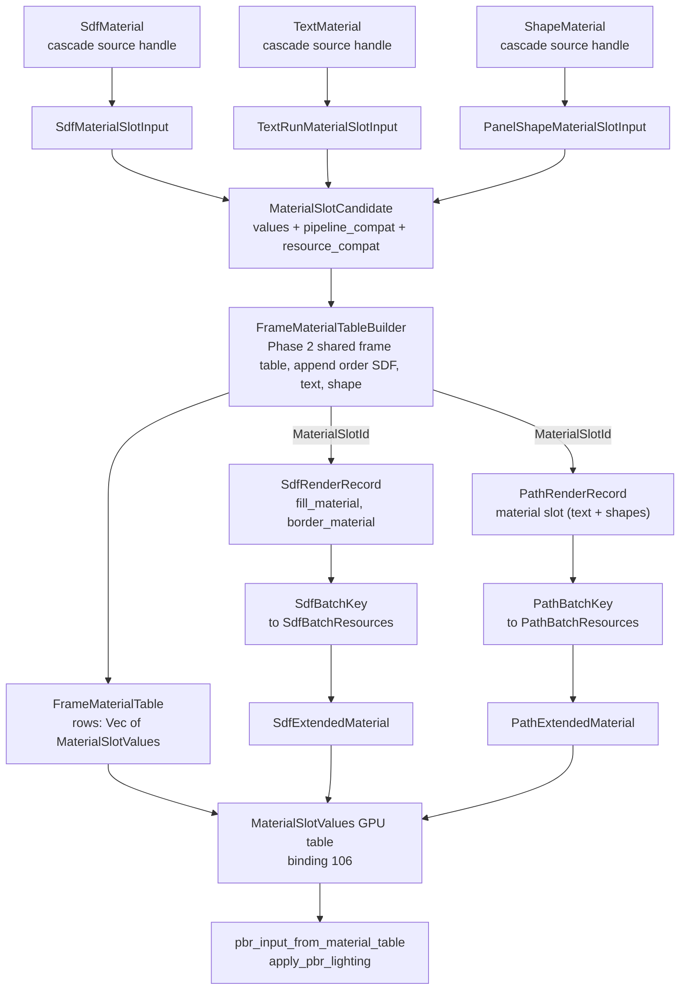
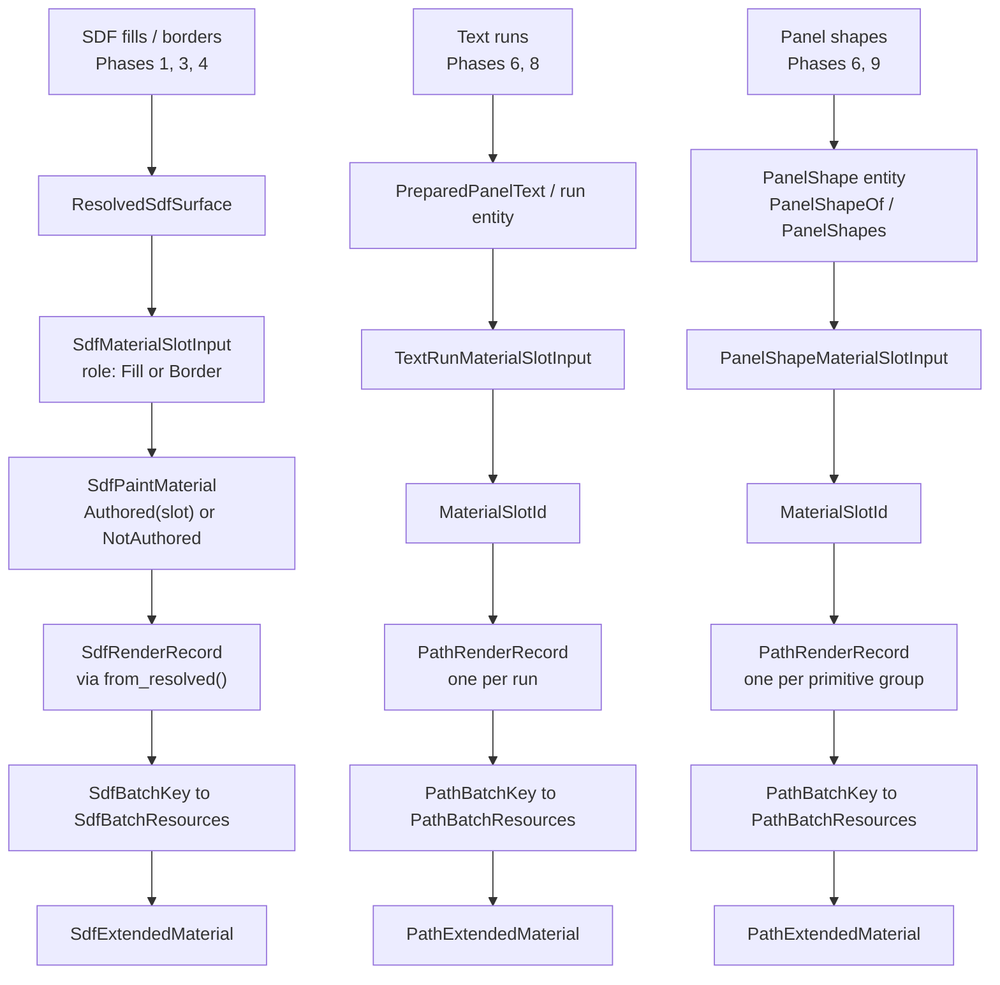
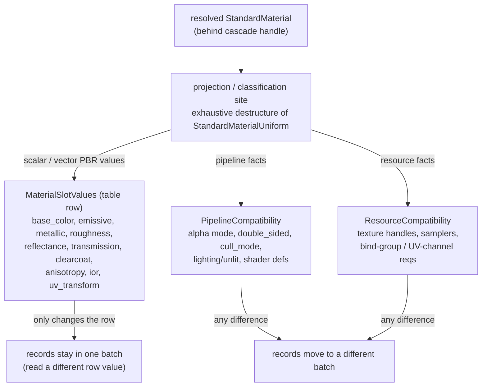
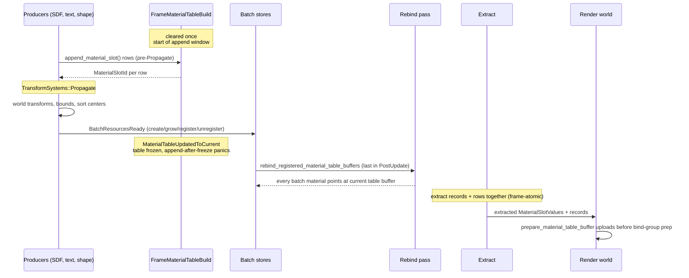
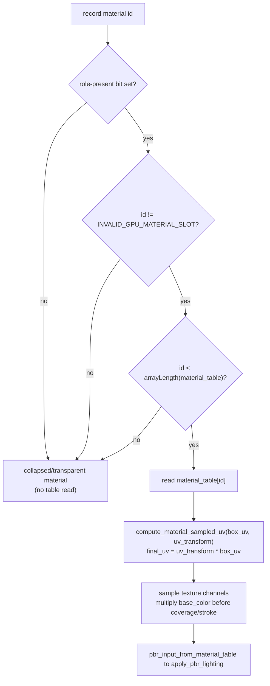

# Batching Call Flow — Diagrams

> Companion to [`sdf-material-table-batching.md`](./sdf-material-table-batching.md).
> Mermaid views of the call flow the plan builds: the three render families
> (SDF fills/borders, text runs, panel shapes) converging on one shared frame
> material table, then splitting back into two batch stores and two render
> materials, both reading the same GPU table.

The plan's load-bearing idea: a batch key carries no scalar/vector PBR values.
Those live in a per-frame dense table (`FrameMaterialTable`) addressed by a
frame-local `MaterialSlotId`. Two records that differ only by table values share
a batch; they split only on pipeline/resource compatibility.

## 1. The whole flow at a glance

Three families, one append path, one table, two batch stores, two render
materials, one shared GPU table buffer.

`StandardMaterial::depth_bias` is deliberately not part of this flow — diegetic
draw-order types own depth/OIT offsets (`DrawOrderProjection`, plus per-record
`oit_depth_offset` / `depth_nudge`).

## 2. Per-family vertical slices

Same backbone, different source identity and record type for each family. SDF
keeps its own key/material; text and panel shapes share the analytic path types.

Notes on the split lines:

- **SDF** has two material roles per surface (`Fill`, `Border`), so its record
  carries two slot fields. `SdfPaintMaterial::NotAuthored` becomes
  `INVALID_GPU_MATERIAL_SLOT` (`u32::MAX`); the shader skips the table read for
  that role.
- **Text and panel shapes share** `PathExtendedMaterial` / `PathExtension` and
  `PathBatchKey` / `PathBatchResources`. They differ only in source identity
  (`run` vs `shape`) and how many `PathRenderRecord`s one source emits
  (text: one per run; shape: one per merged primitive group).
- **Slot id is frame-local.** Every live record re-appends or refreshes its row
  and rewrites its slot id each frame, even with unchanged geometry.

## 3. Where scalar values split from compatibility

What goes in the table vs. what splits a batch — the rule that makes all three
families batch the same way.

## 4. Per-frame schedule order

The append window, the freeze, and the rebind-before-extract guarantee
(Phase 2, R2). Named sets and boundaries, not "freeze/commit" prose.

Frame-atomic guarantee: records and table rows extract together each frame, so a
render-world record never indexes a different frame's table — no N-1-record /
N-row mix.

## 5. Shader read path (shared by all three families)

Both the SDF fill shader and the analytic path shader read the table through one
guarded helper. Direct `material_table[...]` reads outside the helper are
rejected by a shader source tripwire.

## Type reference

| Concept | SDF fills/borders | Text runs | Panel shapes |
|---|---|---|---|
| Cascade source handle | `SdfMaterial` | `TextMaterial` | `ShapeMaterial` |
| Source identity key | `SdfMaterialSourceKey{panel, command_index, role}` | `TextRunMaterialSourceKey{run}` | `PanelShapeMaterialSourceKey{shape}` |
| Append-time input | `SdfMaterialSlotInput` | `TextRunMaterialSlotInput` | `PanelShapeMaterialSlotInput` |
| GPU record | `SdfRenderRecord` | `PathRenderRecord` | `PathRenderRecord` |
| Material slot field | `fill_material` / `border_material: GpuMaterialSlotId` | `material: MaterialSlotId` | `material: MaterialSlotId` |
| Batch key | `SdfBatchKey` | `PathBatchKey` | `PathBatchKey` |
| Batch resources | `SdfBatchResources` | `PathBatchResources` | `PathBatchResources` |
| Render material | `SdfExtendedMaterial` (`SdfExtension`) | `PathExtendedMaterial` (`PathExtension`) | `PathExtendedMaterial` (`PathExtension`) |

Shared by all three: `MaterialSlotCandidate`, `MaterialSlotValues`,
`PipelineCompatibility`, `ResourceCompatibility`, `FrameMaterialTable` /
`FrameMaterialTableBuilder`, `MaterialSlotId` / `GpuMaterialSlotId`, the
`MATERIAL_TABLE_BINDING = 106` GPU table, and the
`pbr_input_from_material_table` / `compute_material_sampled_uv` WGSL helpers.
